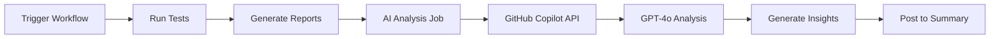

# 🚀 START HERE - GitHub Copilot AI Integration

## ⚡ TL;DR - Bạn Có Gì Ngay Bây Giờ

✅ **AI-powered test analysis** sử dụng **GitHub Copilot**  
✅ **Zero cost** (included in Copilot subscription)  
✅ **Zero configuration** (no API keys needed)  
✅ **Fully integrated** with GitHub Actions CI/CD  
✅ **Ready to use** - just trigger a workflow!  

---

## 🎯 Làm Gì Tiếp Theo?

### Option 1: Test Ngay (5 phút) ⭐ RECOMMENDED

```bash
1. Go to GitHub Actions
   → https://github.com/YOUR_ORG/e2e-playwright/actions

2. Click "E2E Test Automation"

3. Click "Run workflow" button

4. Select:
   Environment: test
   Test Scope: smoke
   Workers: 3

5. Click green "Run workflow" button

6. Wait ~3-5 minutes

7. View AI insights in workflow summary! 🎉
```

### Option 2: Đọc Docs Trước (10 phút)

```bash
1. Read: GITHUB-COPILOT-SETUP.md
   → 5-minute quick start guide
   → Understand how it works
   → See example outputs

2. Read: AI-INTEGRATION-README.md
   → Complete overview
   → Architecture diagram
   → All features explained

3. Then test (Option 1)
```

### Option 3: Test Local Trước (15 phút)

```bash
1. Get GitHub token:
   → https://github.com/settings/tokens
   → Generate new token (classic)
   → Select: repo, workflow

2. Export token:
   export GITHUB_TOKEN='your_token_here'

3. Run demo:
   cd /Users/nam.nguyenduc/e2e-playwright
   chmod +x demo-github-copilot.sh
   ./demo-github-copilot.sh

4. Review output in:
   automationexercise-e2e-pom/test-summary/ai-analysis.json
```

---

## 📚 Document Roadmap

Chọn document phù hợp với needs của bạn:

### 🎯 Quick Start
```
GITHUB-COPILOT-SETUP.md (5 min)
└─ Fast setup, no deep explanation
   Ready to use immediately
```

### 📖 Complete Guide
```
AI-INTEGRATION-README.md (10 min)
├─ Architecture & design
├─ Features & capabilities
├─ Configuration options
└─ Troubleshooting
```

### ✅ Step-by-Step
```
GITHUB-COPILOT-CHECKLIST.md (Follow along)
├─ Pre-integration checks
├─ Testing checklist
├─ Validation steps
└─ Go-live preparation
```

### 📊 Summary & Details
```
GITHUB-COPILOT-INTEGRATION-SUMMARY.md (Reference)
├─ What was implemented
├─ Files created/modified
├─ Benefits vs alternatives
└─ Success criteria
```

### 🆚 Compare Options
```
AI-MODEL-ALTERNATIVES.md (Decision making)
├─ GitHub Copilot vs OpenAI
├─ GitHub Copilot vs Gemini
├─ GitHub Copilot vs Ollama
└─ Migration guides
```

---

## 🎬 Quick Demo - What Will Happen

### When You Run Tests:



### You Will See:

```markdown
## 🤖 AI-Powered Test Analysis

### 📊 AI Analysis Results
| Metric | Value |
|--------|-------|
| Health Score | 92/100 🟢 Excellent |
| Trend | Improving |
| AI Analysis | ✅ Enabled (gpt-4o) |
| Failures Analyzed | 1 |
| Root Causes Found | 1 |

### 💡 Top AI Recommendations
1. Fix authentication timeout in login test
2. Add retry logic for network-dependent tests
3. Improve error handling in checkout flow
```

### You Will Get:

1. **Workflow Summary** - AI insights right in GitHub
2. **JSON Artifact** - `ai-analysis-{run_number}.zip`
3. **PR Comment** - (if workflow triggered by PR)
4. **Historical Data** - Archived for trend analysis

---

## ❓ FAQ

### Q: Do I need to pay for GitHub Copilot?
**A**: You need a GitHub Copilot subscription, but the AI analysis itself costs $0 extra.

### Q: What if I don't have Copilot?
**A**: Use free Gemini instead! See `GEMINI-QUICK-START.md`

### Q: Is my test data secure?
**A**: Yes, data is processed within GitHub infrastructure. See security section in `GITHUB-COPILOT-SETUP.md`

### Q: Can I change the AI model?
**A**: Yes! Edit `GITHUB_MODEL` in workflow:
```yaml
env:
  GITHUB_MODEL: gpt-4o-mini  # or o1-preview, o1-mini
```

### Q: What if AI analysis fails?
**A**: System automatically falls back to statistical analysis. No workflow failure.

### Q: How accurate is the AI analysis?
**A**: Very good! GPT-4o is state-of-the-art. But always review recommendations.

---

## 🎯 Success Indicators

You know it's working when you see:

✅ "AI Test Analysis (GitHub Copilot)" job passes  
✅ Workflow summary shows AI insights  
✅ `ai-analysis.json` artifact available  
✅ Quality status matches test results  
✅ Recommendations are relevant  

---

## 🚨 Common Issues & Quick Fixes

### "GITHUB_TOKEN not found"
→ Token is automatic in GitHub Actions. Check workflow permissions.

### "No Copilot subscription"
→ Verify at https://github.com/settings/copilot or switch to Gemini

### "Rate limit exceeded"
→ Use `gpt-4o-mini` model or add delays between runs

### "No AI analysis output"
→ Check if `metrics.json` exists in test-summary/

---

## 📞 Need Help?

### Documentation
1. `DOCUMENTATION-INDEX.md` - Find all docs
2. `GITHUB-COPILOT-SETUP.md` - Quick start
3. `AI-INTEGRATION-README.md` - Full guide

### Testing
1. Run `demo-github-copilot.sh` locally
2. Check workflow logs for errors
3. Review `ai-analysis.json` output

### Support
1. Check troubleshooting in docs
2. Review GitHub Actions logs
3. Open issue with details

---

## 🎉 You're Ready!

Everything is set up and ready to go:

✅ Code integrated  
✅ Workflow configured  
✅ Documentation complete  
✅ Demo script available  

**Next Action**: Pick an option from "Làm Gì Tiếp Theo?" above and start! 🚀

---

## 🗺️ File Structure Quick Reference

```
e2e-playwright/
│
├── 🎯 START HERE.md                    ← You are here!
│
├── 📘 Quick Start Guides
│   ├── GITHUB-COPILOT-SETUP.md         (5 min - Best place to start)
│   ├── GITHUB-COPILOT-CHECKLIST.md     (Checklist format)
│   └── demo-github-copilot.sh          (Test locally)
│
├── 📖 Complete Guides
│   ├── AI-INTEGRATION-README.md        (Full overview)
│   ├── GITHUB-COPILOT-INTEGRATION-SUMMARY.md (Detailed summary)
│   └── AI-MODEL-ALTERNATIVES.md        (Compare options)
│
├── 🔧 Technical Files
│   ├── ai-analysis/
│   │   ├── analyze-github.py           (Main AI script)
│   │   └── requirements-github.txt     (Dependencies)
│   └── .github/workflows/
│       └── e2e-automation.yml          (CI/CD workflow)
│
└── 📚 Reference
    └── DOCUMENTATION-INDEX.md          (All docs indexed)
```

---

## 💡 Pro Tips

1. **Start Simple**: Run smoke tests first to see AI in action
2. **Review Output**: Check `ai-analysis.json` to understand format
3. **Iterate**: Improve prompts based on AI output quality
4. **Share**: Show team the AI insights in workflow summary
5. **Monitor**: Track AI recommendation accuracy over time

---

## 🎓 Learning Path

### Beginner (Day 1)
- [ ] Read `GITHUB-COPILOT-SETUP.md`
- [ ] Trigger one workflow run
- [ ] Review AI insights in summary

### Intermediate (Week 1)
- [ ] Read `AI-INTEGRATION-README.md`
- [ ] Run 5+ workflow executions
- [ ] Download and review JSON artifacts

### Advanced (Month 1)
- [ ] Customize AI prompts
- [ ] Add AI insights to notifications
- [ ] Build trends dashboard

---

## 🏆 Expected Outcomes

After setup, you will have:

✅ **Automated test analysis** every workflow run  
✅ **Smart insights** on test failures  
✅ **Actionable recommendations** from AI  
✅ **Risk assessment** for deployments  
✅ **Historical tracking** of test health  
✅ **Zero additional cost** for AI analysis  

---

## 🚀 Let's Go!

Pick your path and start:

1. ⚡ Quick test → Run workflow now
2. 📖 Read first → `GITHUB-COPILOT-SETUP.md`
3. 🧪 Local test → `./demo-github-copilot.sh`

**Any path works - choose what feels right!** 

The important thing is to **start** and see the AI magic! ✨

---

**Questions?** All answers are in the docs. Check `DOCUMENTATION-INDEX.md` first!

**Ready?** Go! 🚀

---

*Made with ❤️ using GitHub Copilot*  
*Setup time: ~5 minutes*  
*Cost: $0*  
*Magic: ∞*
